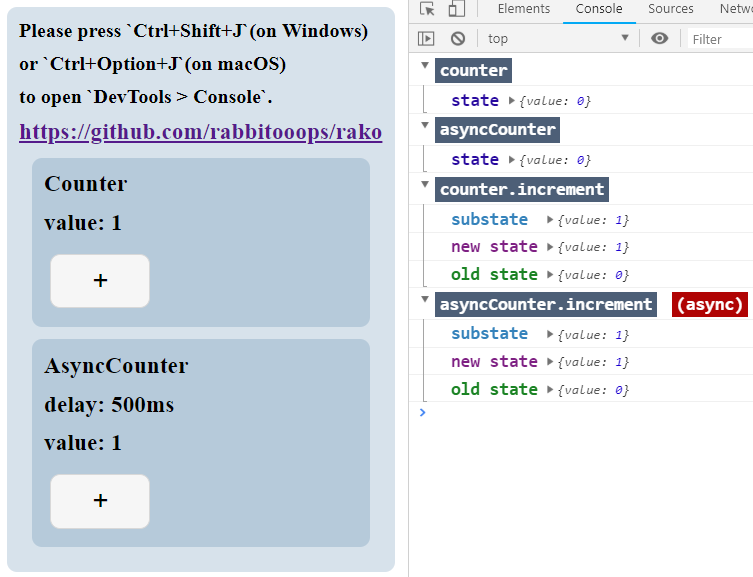

# Rako


## Introduction

Rako is a declarative, predictable, scalable and high cohesion state container inspired by `OOP` and the purpose of redux's `action.type` for Javascript apps.

You don't need to learn any concept, just use it. Really simple but powerful. 

**Rako is an entirely new design instead of redux like state container.**


**In fact, Rako is more like a Controller in MVC.**


## Installation

`yarn add rako` or `npm install rako`.


## Work with React

`rako-react`: https://github.com/rabbitooops/rako-react


## Example

https://codesandbox.io/s/011136qpkn

After you open the link of **codeSandbox** above, because **codeSandbox** doesn't support `console.group`, please press **`Ctrl + Shift + J`**(on Windows) or **`Ctrl + Option + J`**(on macOS) to open **DevTools > Console**.




## Design

Rako is inspired by `OOP`, simple and intuitive.

```js
const counter = {
  value: 0,
  increment() {
    this.value += 1
  }
}
counter.increment()
```

Let's transform it for fitting our design:

> 1. Immutable state.
> 2. Do some side effects every updating.

```js
function counter(getState) {
  return {
    value: 0,
    increment() {
      const {value} = getState()
      this.update({value: value + 1})
    }
  }
}
const {counter$} = createStores({counter})

const actions = counter$.getActions()
actions.increment()
```

It's very similar to former, just **use a function to wrap `counter`, use parameter `getState` to get state and use `this.update` to update state.**
This simple design is enough for Rako to do some magical things in background.

`createStores` receives an object, returns a processed object(every key in object was transformed to `` `${key}$` ``). In this case, `counter` was renamed `counter$`(as a shorthand of `counterStore`), `counter$` is an instance of Rako's `Store`.


Let's get state:
```js
counter$.getState() // {value: 0}
```

Let's susbscribe some side effects:
```js
counter$.subscribe(state => console.log('subscribe', state))
```

Let's update state. Before updating, you have got to get `actions` from `counter$`:
```js
const actions = counter$.getActions()
```

Then, increase value:
```js
actions.increment()
```

after calling it, the Console will print `subscribe {value: 1}` after updating state.

That's all usages of Rako! really simple.


## API

#### `createStores(producers: object, ...enhancers: Array<enhancer>): object`

#### `store.subscribe(listener: function): function`

#### `store.getState(): object`

#### `store.getActions(): object`


## Note

**`action` in Rako is different to Redux's.**

**`action` in Rako is equivalent to OOP's `method`.** In other words, `action` is belong to someone, `action` in Rako is to be used by someone to do something.

For example, `increment` is belong to `counter$`, `counter$` use `increment` to increase value.

But `action` in Redux is not belong to anyone, because Redux's data flow is `Process-oriented programming`, Redux dispatch an `action` to trigger a recalculation.
